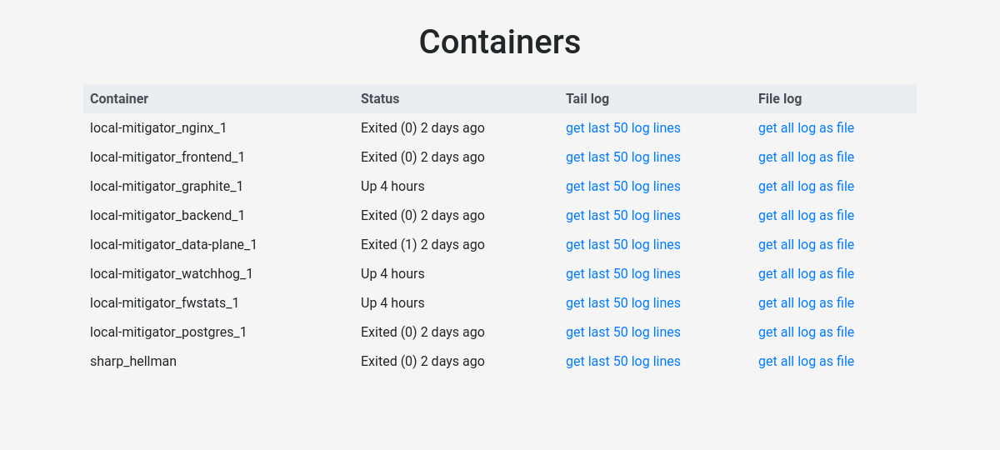

# LogDok



## Что

Сервис для отображения статуса контейнеров на *хосте* с ссылками на лог;

## Как

На главной (статичной, с асинхронным включением контента) странице отображается
статус всех контейнеров: аналог `docker ps --all`;

В основе -- простое проксирование запросов к Dockerd API;

При переходе по ссылке -- отдается исходных лог (если поддерживается) + [header](https://docs.docker.com/engine/api/v1.40/#operation/ContainerAttach)

## Настройка Nginx

* Пользователь (`user` в `nginx.conf`), от которого выполняется запуск nginx,
должен иметь `RW` права на `docker.sock` (входить в группу `docker`, например)

* В целях безопасности, стоит заблокировать все хендлеры и методы, кроме `/containers` и `GET` соответственно

Привер конфигурации:

```nginx
server {
  listen 80;
  location /containers {
    limit_except GET {
      deny all;
    }
    proxy_pass http://unix:/var/run/docker.sock;
  }
  location / {
    root /var/www/logdok/static;
  }
}
```
